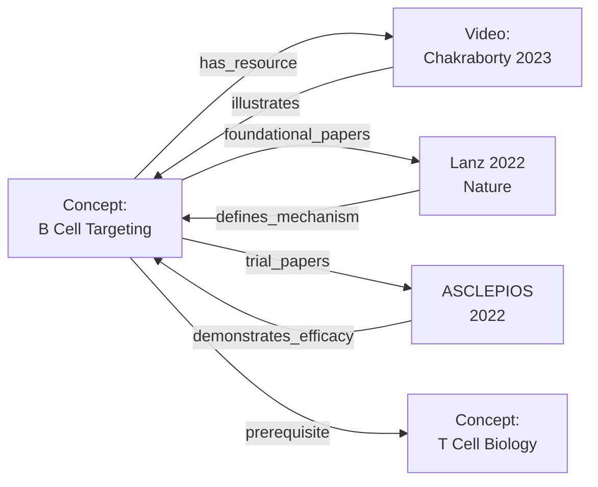

# Resource Curator Template: Binding Videos, Tools, Products to MS Learning Concepts

**Version**: 1.0  
**Date**: 2026-04-08  
**Purpose**: Systematically curate and validate non-paper resources that support concept learning

---

## I. Resource Types and Selection Criteria

### **Type 1: Educational Videos & Lectures**

**Where to find**:
- YouTube (search for author names + topic)
- Academic channels: AcademicNeurology, Osmosis, Khan Academy, NEJM Knowledge+
- Conference recordings: AAN, ECTRIMS, ACTRIMS
- University course recordings (MIT OpenCourseWare, Yale Open Courses)
- TED Talks on neuroscience topics

**Selection Criteria**:
- Accuracy (fact-checked, by recognized expert or institution)
- Clarity (suitable for target learner level)
- Length (prefer 8-25 min for concepts; longer for deep dives)
- Recency (prefer <5 years old, unless historical/foundational)
- Accessibility (free or available at learner's institution)

**What to document**:
```csv
concept_id,resource_type,title,url,creator,institution,year,length_minutes,bloom_level,
accuracy_check_by,accuracy_check_date,notes
```

**Example**:
```
b_cell_biology,video,"B Cell Development and Activation","https://youtu.be/...",
"Arup Chakraborty","MIT",2023,18,Understand,"Dr. X (immunologist)",2026-04-08,
"Explains germinal centers, class switching; animation-based"
```

---

### **Type 2: Interactive Tools & Calculators**

**Categories**:
- **Clinical decision aids**: EDSS calculator, MS phenotype predictor, relapse severity
- **Educational simulations**: Virtual lesion formation, immune cell interactions
- **Data explorers**: GWAS Manhattan plot explorer, drug interaction checker
- **Comparison tools**: DMT NNT/NNH comparison, imaging differential diagnosis

**Where to find**:
- Hospital/clinic websites (Mayo, Johns Hopkins, Cleveland Clinic, etc.)
- NIH/CDC public resources
- Open-source projects (GitHub)
- Commercial sites (filtered for free/public tools)

**Selection Criteria**:
- Utility (actually helps learners understand or apply a concept)
- Accuracy (validated against expert judgment or gold standard)
- Usability (intuitive interface, mobile-friendly preferred)
- Maintenance (site active, data current)

**What to document**:
```csv
concept_id,resource_type,title,url,tool_category,institution,year_updated,
interactive_format,validation_status,notes
```

**Example**:
```
diagnostic_criteria,tool,"McDonald Criteria 2024 Calculator",
"https://example.com/mcdonald-calc",Clinical Decision Aid,
"Johns Hopkins",2025,Web-based Interactive,"Validated against 500 cases",
"Implements McDonald 2024 revisions; supports diagnosis workflows"
```

---

### **Type 3: Clinical Products & Professional Resources**

**Categories**:
- **Patient/clinician registries**: MSBase, ClinicaIMD, AMSY (real-world outcomes)
- **Drug databases**: Micromedex, Lexicomp (pharmacology/safety)
- **Imaging platforms**: PACIS, Carestream (for imaging teaching)
- **Clinical guidelines**: MS Societies, neurological associations
- **EHR/EMR templates**: Documentation tools for MS clinics

**Where to find**:
- Professional organization websites (AAN, National MS Society, ECTRIMS)
- Hospital institutional resources
- Pharma/biotech educational content (reputable manufacturers)
- Society journals (free supplements, consensus statements)

**Selection Criteria**:
- Authority (published by recognized society or institution)
- Currency (updated within 2 years for clinical guidance)
- Accuracy (peer-reviewed or expert-vetted)
- Practical utility (actually used in clinical practice or learning)
- Free/accessible (no paywall if possible)

**What to document**:
```csv
concept_id,resource_type,title,url,organization,year_published,
evidence_basis,clinical_utility,accessibility,notes
```

**Example**:
```
epidemiology_treatment,registry,"MSBase – Real-World MS Outcomes Registry",
"https://www.msbasis.org",International MS Genetics Consortium,2020,
"Observational (N=50K+)","Tracks DMT effectiveness, safety, outcomes",
"Free to browse; registration required for detailed access",
"Largest real-world MS registry; useful for treatment patterns, prognostic factors"
```

---

### **Type 4: Open Datasets & Research Resources**

**Categories**:
- **Genomic data**: IMSGC GWAS, UK Biobank, dbGaP
- **Neuroimaging**: BrainVISA, ADNI (some MS data), MS lesion segmentation datasets
- **Clinical datasets**: iMS registry, UK MS Registry
- **Model organism**: EAE data repositories, cuprizone model protocols

**Where to find**:
- NIH/NSF data repositories (NIH Data Commons, Zenodo)
- Journal supplementary materials (Nature, Science, Lancet)
- OSF (Open Science Framework)
- GitHub (research code/data)
- ClinicalTrials.gov (trial protocols, sometimes aggregate data)

**Selection Criteria**:
- Reusability (clear license, documented schema)
- Scale (enough data to learn from)
- Quality (QC documented, missing data reported)
- Documentation (data dictionary, methods paper available)

**What to document**:
```csv
concept_id,resource_type,title,url,data_type,n_samples,access_model,
license,supporting_paper,notes
```

**Example**:
```
genetic_susceptibility,dataset,"International MS Genetics Consortium GWAS Summary Statistics",
"https://gwas.mssociety.org",SNP array genotypes + phenotypes,50000,
Open (download),CC-BY,"Hauser SL, et al. Science 2019",
"159 MS loci identified; useful for teaching gene discovery and effect sizes"
```

---

## II. Curation Workflow

### **Step 1: Identify Gap in Concept Coverage**
```
Concept: "B Cell-Targeted Therapies"
Current Resources: 5 papers
Gap: No video explanation for undergraduates; no DMT comparison tool
Priority: HIGH (foundational concept, underserved)
```

### **Step 2: Search for Candidate Resources**
```
Search Strategy:
  - Google: "B cell depletion MS video tutorial" 
  - YouTube: channel:"AcademicNeurology" "B cell" 
  - GitHub: topic:"MS" topic:"tool" 
  - NIH/CDC: site:nih.gov "B cell therapy"
  - Twitter/ResearchGate: Keyword alert on authors we trust

Candidate Pool: 10-20 videos, 3-5 tools, 2-3 clinical resources
```

### **Step 3: Pre-Screen (5-min per resource)**
```
Quick checks:
  ✓ Is this resource accessible (free or via institution)?
  ✓ Is it accurate (expert-created or peer-reviewed)?
  ✓ Is it current enough (published <5 years ago, or timeless foundation)?
  ✓ Would it actually help a learner (useful vs. clickbait)?
  
If all ✓, move to detailed evaluation. Otherwise, exclude.
```

### **Step 4: Detailed Evaluation (15-30 min per resource)**

Use this rubric (1-5 scale, 3+ means include):

| Criterion | Score | Comment |
|-----------|-------|---------|
| **Accuracy** | 5 | Facts align with current consensus; no obvious errors |
| **Clarity** | 4 | Well-explained; some jargon but appropriate for target level |
| **Completeness** | 3 | Covers core content; acceptable gaps |
| **Engagement** | 4 | Visually interesting; good pacing |
| **Currency** | 4 | Published 2023; methods still valid |
| **Accessibility** | 5 | Freely available; no registration required |
| **Bloom's Level** | U | Appropriate for "Understand" level |
| **Prerequisite Alignment** | ✓ | Assumes knowledge of basic immunology ✓ |
| **Utility** | 4 | Learner can immediately apply concepts to DMT trials |
| **TOTAL** | 38/50 | **INCLUDE** (threshold: 30+) |

### **Step 5: Create Resource Entry**
```json
{
  "concept_id": "b_cell_targeted_therapy",
  "resource_id": "vid_bcell_2023_chakraborty",
  "type": "video",
  "title": "B Cell Biology and Depletion in Multiple Sclerosis",
  "url": "https://www.youtube.com/watch?v=...",
  "creator": "Arup Chakraborty, MIT",
  "year": 2023,
  "length_minutes": 22,
  "bloom_level": "Understand",
  "prerequisites": ["t_cell_b_cell_biology", "neuroinflammation"],
  "accuracy_score": 5,
  "clarity_score": 4,
  "completeness_score": 3,
  "engagement_score": 4,
  "currency_score": 4,
  "accessibility_score": 5,
  "overall_score": 38,
  "rationale": "Animations explain germinal centers, class switching, and anti-CD20 mechanisms",
  "strengths": ["Clear visual metaphors", "expert creator", "free access"],
  "limitations": ["Does not discuss infection risk; see complementary papers"],
  "curated_by": "Dr. X",
  "curation_date": "2026-04-08",
  "last_validation": "2026-04-08",
  "validation_notes": "Verified accuracy; link tested; no paywall"
}
```

---

## III. Meta-Resource: The Curator's Checklist

Use this before finalizing any resource inclusion:

### **Authority Check**
- [ ] Creator/organization is recognized expert or institution
- [ ] No obvious conflicts of interest (e.g., pharma marketing disguised as education)
- [ ] Content is peer-reviewed, expert-vetted, or published by reputable org
- [ ] If video: presenter has relevant degree/credentials visible

### **Accuracy Check**
- [ ] Factual claims align with current guidelines (McDonald 2024, Kuhlmann 2023, etc.)
- [ ] Mechanisms match peer-reviewed literature
- [ ] No scientific misconceptions or outdated claims
- [ ] If mechanistic, cite source papers or indicate they're speculative

### **Clarity Check**
- [ ] Pitch appropriate for target learner (undergrad ≠ PhD student ≠ clinician)
- [ ] Technical jargon defined or introduced gradually
- [ ] Visuals (if present) support rather than confuse
- [ ] Key takeaways explicitly stated at end

### **Completeness Check**
- [ ] Covers core learning objectives for the concept
- [ ] Identifies gaps that remaining resources should fill
- [ ] Acknowledges what it does NOT cover

### **Utility Check**
- [ ] Learner can take away actionable knowledge
- [ ] Connects to prior concepts (prerequisites met?)
- [ ] Supports next learning step
- [ ] Avoids "nice-to-know" unless explicitly teaching history

### **Accessibility Check**
- [ ] Free or low-cost access (or available at learner institutions)
- [ ] URL tested and working (live link, not archived)
- [ ] Language/captions available if video (English minimum; other languages bonus)
- [ ] Device accessibility (mobile-friendly preferred)

### **Freshness Check**
- [ ] Publication date documented
- [ ] For guidelines: updated within 2 years (or explicitly marked "classic")
- [ ] For clinical content: reflects current practice standards
- [ ] For research: methods still valid (bioinformatics not hopelessly dated)

---

## IV. Integration with Knowledge Graph

### **Schema: Resource ↔ Concept ↔ Papers**



### **Data Model for Integrated Storage**

```json
{
  "concept": {
    "id": "b_cell_targeted_therapy",
    "title": "B Cell-Targeted Therapies",
    "resources": [
      {
        "id": "vid_bcell_2023_chakraborty",
        "type": "video",
        "title": "...",
        "url": "...",
        "bloom_level": "Understand"
      },
      {
        "id": "paper_lanz_2022_nature",
        "type": "paper",
        "doi": "10.1038/...",
        "bloom_level": "Analyze"
      }
    ],
    "prerequisite_concepts": ["t_cell_b_cell_biology"],
    "related_concepts": ["btk_inhibitors", "treatment_monitoring"]
  }
}
```

---

## V. Curator Maintenance Schedule

| Task | Frequency | Owner | Notes |
|------|-----------|-------|-------|
| Add new resources (papers, videos, tools) | Monthly | Editorial team | Scan conferences, new publications |
| Validate resource URLs | Quarterly | Automated bot + manual check | Update dead links, flag moved content |
| Accuracy spot-check | Quarterly | Domain experts | Sample 10-20 resources; full review annually |
| Add fresh guidelines/consensus statements | As published | Domain experts | McDonald, MAGNIMS, ECTRIMS consensus |
| User feedback integration | Monthly | Feedback system | Learners flag confusing/outdated resources |
| Sunset old resources | Annually | Editorial team | Archive papers >8 years old unless landmark; remove dead links |

---

## VI. Tools for Resource Management

### **Spreadsheet Template** (Google Sheets / Excel)
```
| Concept ID | Resource ID | Type | Title | URL | Creator | Year | Bloom | 
| Score | Curated By | Curation Date | Last Validated | Notes |
```

### **Automated Checklist** (Pre-curation script)
```python
def validate_resource(url, title, type):
    """Check URL accessibility, certificate validity, etc."""
    checks = [
        ("URL accessible", test_url_accessible(url)),
        ("HTTPS enabled", url.startswith("https")),
        ("Title non-empty", len(title) > 5),
        ("Type recognized", type in VALID_TYPES),
    ]
    return {c[0]: c[1] for c in checks}
```

### **Curator Dashboard** (Optional future state)
- View current resource inventory by concept
- Flag out-of-date resources
- Track curation workload
- Generate coverage reports

---

## VII. Examples of Well-Curated Concept Resources

### **Concept: "Demyelination and Remyelination"**
```
📄 Papers (Foundational):
  • Lassmann H, Bradl M (2010) "Neuropathology of MS" [Pathology classic]
  • Franklin RJ, Ffrench-Constant C (2008) "Nat Rev Neurosci" remyelination review

📊 Papers (Advanced):
  • Recent cuprizone + EAE demyelination papers
  • Remyelination failure mechanisms (oligodendrocyte differentiation)

🎥 Videos:
  • Chakraborty MIT: "Myelin Biology and Demyelination" (20 min, Understand level)
  • NEJM Knowledge+: "MS Pathology 101" (8 min, Remember level)

🔧 Tools:
  • EAE lesion evolution simulator (University of Edinburgh)
  • Myelin damage calculator (estimate axonal exposure from lesion size)

📚 Datasets:
  • EAE lesion segmentation dataset (NIH, 500 images)
  • Cuprizone timeline pathology (zenodo, raw images)

💊 Clinical Resources:
  • Lassmann neuropathology atlas (Nature Reviews link)
  • MS-associated pathology checklist for pathologists
```

---

## VIII. Common Pitfalls to Avoid

❌ **Don't**:
- Include marketing content from pharma (even if accurate)
- Add resources just because they're "cool" (must serve learning objective)
- Mix resources of wildly different quality tiers without flagging difficulty
- Include paywalled resources without clear institutional access pathway
- Add video without checking accuracy (especially mechanisms)
- Curate resources from single author (increases bias)

✅ **Do**:
- Verify facts against 2-3 independent sources
- Explicitly state prerequisites and Bloom's level
- Explain why this resource is better than alternatives
- Link resources to papers (cross-validation)
- Archive old resources with deprecation date
- Solicit feedback from learners on usefulness

---

## IX. Feedback Integration

### **Learner Feedback Form** (Embedded in learning platform)
```
Just watched [VIDEO TITLE]. How helpful was it?

1. Was the explanation clear? (1-5)
2. Did it assume too much/too little background knowledge? (1-5)
3. What question do you still have? [Free text]
4. Suggest a follow-up resource: [Free text]
5. Any errors you noticed? [Free text]

→ Feedback aggregated monthly → Curator review → Update rationale or sunset resource
```

### **Curator Response Protocol**
- **Accuracy error flagged**: Validate independently; add correction note or update resource
- **"Too hard" feedback**: Add simpler prerequisite or recommend Bloom's level downward
- **Missing resource suggestion**: Add to candidate pool; evaluate next month
- **Dead link**: Archive resource; find replacement

---

**Questions? Suggestions?** File an issue or submit a pull request with:
- New resource recommendations (with rationale)
- Concept gaps not covered by current resources
- Curator workflow improvements
